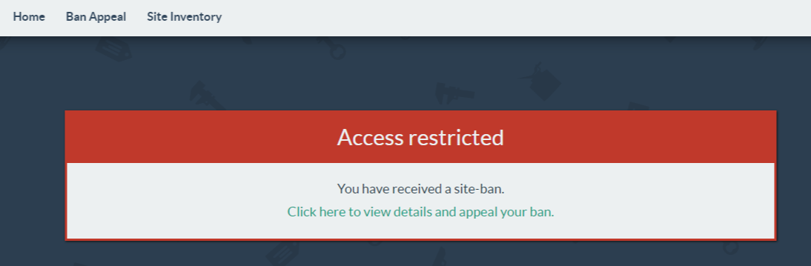
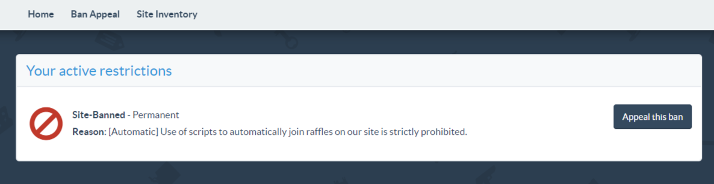

# End of an era  
After using for more than a 18 months, this bot become **detected** since august 2023.  
This means that you'd better not use it without improving!

  

  

# How is it developed?  
IDE: IntelliJ IDEA 2023.1.1 (Community Edition)  
SDK: correto-1.8  
Language level: 8  
Build System: Gradle  
Tested on: Windows 10 x64 - JRE SE 8  

# Quick start  
1. Open project with IntelliJ IDEA  
2. **Build** -> **Build Artifacts** -> **scrap.tf_rafflebot:jar** -> **Build**  
3. Go to compiled .jar file, he stored by default in  *\out\artifacts\scrap_tf_rafflebot_jar*  
4. Open *.jar* by double-clicking  